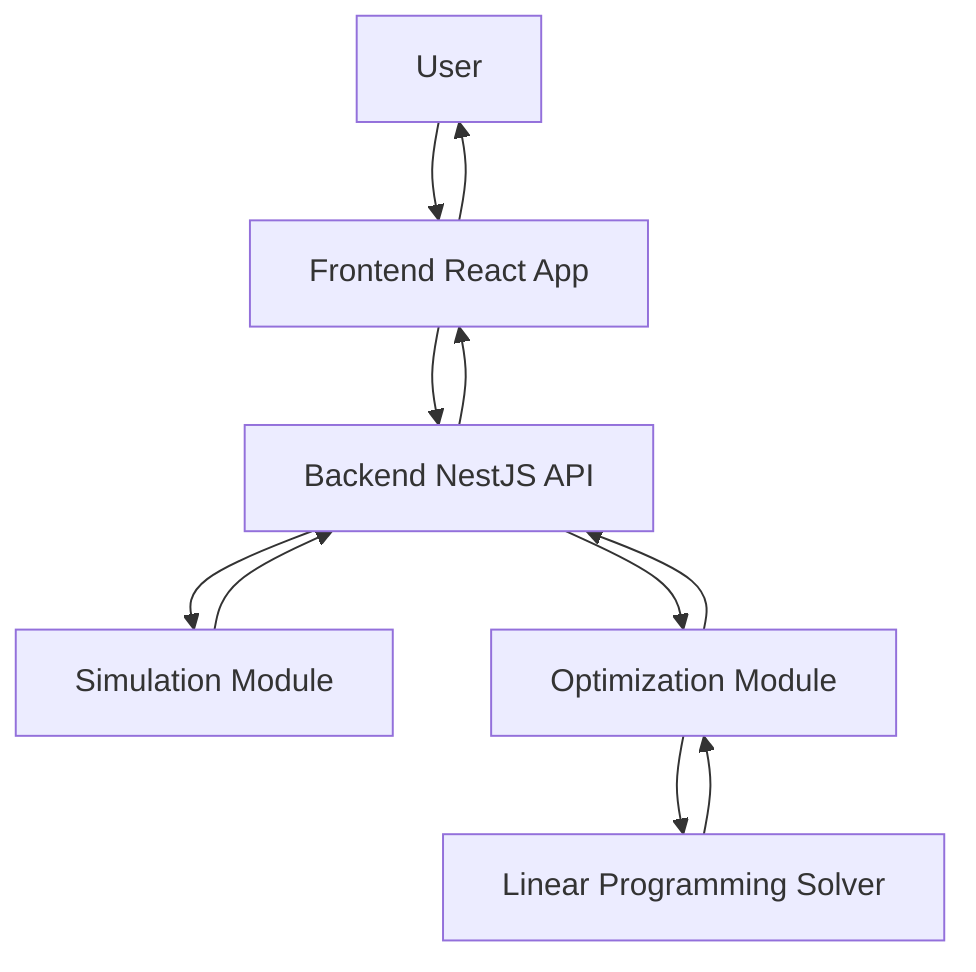
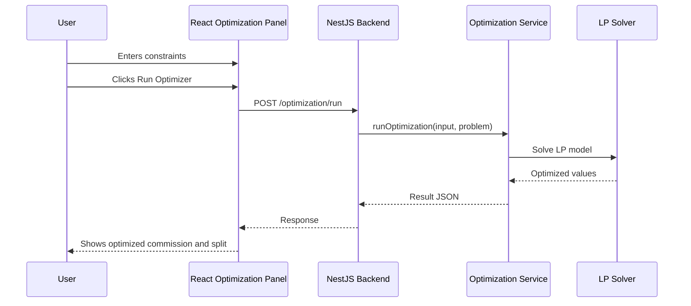
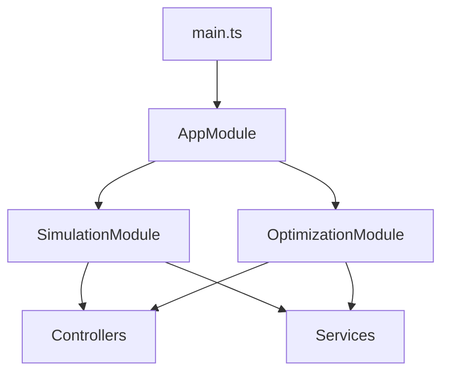
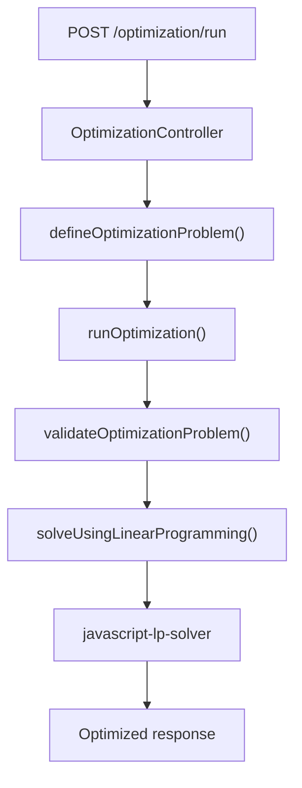

# Project High-Level Guide

## 1. What This Project Is

This project is a real estate commission calculation and optimization app.

It has two sides:

- Frontend: React app used by a user to enter sales, commission rules, deductions, and optimization limits.
- Backend: NestJS API that receives the data, runs calculations, and returns results.

The main business question is:

```text
For a real estate deal or set of deals, how much money goes to the agent and how much goes to the brokerage?
```

The optimization question is:

```text
What commission structure gives the best result while staying inside allowed limits?
```

For this assignment, the most important backend feature is:

```text
Optimization Solver - Linear Programming API
```

That means the main route to understand is:

```text
POST /optimization/run
```

## 2. Why This Project Exists

Real estate brokerages need to calculate commissions correctly.

A single transaction can include:

- sale price
- commission percentage
- agent split
- brokerage split
- referral fees
- lead fees
- transaction coordinator fees
- insurance fees
- annual brokerage cap
- competitor commission structures

Doing this manually can cause mistakes.

This app helps by:

1. Taking transaction and commission data from the user.
2. Calculating expected payouts.
3. Comparing different commission structures.
4. Suggesting optimized values using a solver.

## 3. Important Project Terms

### Agent

The real estate salesperson who earns commission from the deal.

### Brokerage

The company that the agent works under. The brokerage usually takes part of the commission.

### Commission

Money earned from a property sale.

Example:

```text
Sale price = 500000
Commission percent = 6%
Total commission = 500000 * 0.06 = 30000
```

### Agent Split

The percentage of commission that goes to the agent.

Example:

```text
Agent split = 80%
Brokerage split = 20%
```

If total commission is 30000:

```text
Agent gets 24000
Brokerage gets 6000
```

### Brokerage Split

The percentage of commission that goes to the brokerage.

In this project:

```text
brokerageSplitPercent = 100 - agentSplitPercent
```

### Deduction

A fee subtracted from commission.

There are two main types:

- Pre-split deduction
- Post-split deduction

### Pre-Split Deduction

A fee removed before the commission is split between agent and brokerage.

Example:

```text
Total commission = 30000
Referral fee = 2000
Commission left to split = 28000
```

### Post-Split Deduction

A fee removed after the agent gets their share.

Example:

```text
Agent share = 24000
Transaction coordinator fee = 300
Agent final payout = 23700
```

### Annual Cap

A limit on how much the brokerage can collect from an agent in a year.

Example:

```text
Annual cap = 16000
```

After the brokerage has collected 16000 from that agent, the agent may keep more of future commissions depending on the commission structure.

### Optimization

Optimization means finding the best values based on rules.

In this project, optimization tries to find good values for:

- commission percentage
- agent split percentage
- brokerage split percentage

### Constraint

A rule or limit the optimizer must follow.

Example:

```text
Commission must be between 2% and 6%.
Agent split must be between 60% and 85%.
```

### Linear Programming

Linear Programming, or LP, is a mathematical method for finding the best result while following limits.

Simple meaning:

```text
Pick the best value, but stay inside the allowed range.
```

### Genetic Algorithm

Genetic Algorithm, or GA, is another optimization method. It tries many possible solutions and improves them over multiple rounds.

For this assignment, do not focus on GA.

Focus on LP.

### Pareto Front

Pareto front is used for comparing tradeoffs between two goals.

Example:

```text
More money for agent vs more profit for brokerage
```

For this assignment, Pareto is not the main focus.

## 4. Full App Picture

At a high level, the app works like this:



In plain English:

1. User enters data in the frontend.
2. Frontend sends JSON data to backend.
3. Backend decides which module should handle the request.
4. Simulation module calculates normal commission results.
5. Optimization module finds better commission settings.
6. Backend returns JSON response.
7. Frontend displays the result.

## 5. Client Side: React Frontend

The frontend is inside:

```text
frontend/
```

The main frontend file is:

```text
frontend/src/App.tsx
```

The frontend has tabs such as:

- Simulation & Split Builder
- AI Optimization Hub
- What-If Comparison Dashboard
- Audit Trail & Disbursement

For the assignment, the important frontend section is:

```text
AI Optimization Hub
```

That section uses:

```text
frontend/src/components/OptimizationPanel.tsx
```

## 6. Frontend to Backend API Calls

The frontend connects to the backend using:

```text
API_BASE = http://localhost:3000
```

This is defined in:

```text
frontend/src/App.tsx
```

The frontend sends data to these backend APIs:

```text
POST /simulation
POST /simulation/agent-summary
POST /simulation/compare
POST /optimization/run
POST /optimization/pareto
```

For this assignment, focus on:

```text
POST /optimization/run
```

## 7. Client Flow for LP Optimization

The client flow looks like this:



## 8. Backend Side: NestJS Structure

The backend is inside:

```text
src/
```

Important files:

```text
src/main.ts
src/app.module.ts
src/optimization/optimization.module.ts
src/optimization/optimization.controller.ts
src/optimization/optimization.service.ts
src/dto/simulation-input.dto.ts
src/dto/optimization-problem.dto.ts
src/dto/optimized-parameters.dto.ts
```

## 9. NestJS Compared to Express

If you know Express, think of NestJS like this:

```text
NestJS file or concept             Express equivalent

main.ts                            server.js or app.js
Controller                         router file
Service                            business logic file
DTO                                request/response type shape
Module                             wiring/registration file
@Post()                            router.post()
@Body()                            req.body
@Query()                           req.query
```

Example:

NestJS:

```ts
@Controller('optimization')
export class OptimizationController {
  @Post('run')
  runOptimization(@Body() input: SimulationInputDto) {
    return this.optimizationService.runOptimization(input, problem);
  }
}
```

Express-style thinking:

```js
router.post('/optimization/run', (req, res) => {
  const result = optimizationService.runOptimization(req.body);
  res.json(result);
});
```

## 10. Backend Startup Flow

The backend starts from:

```text
src/main.ts
```

Flow:



In plain English:

1. `main.ts` starts the NestJS app.
2. `AppModule` loads the app modules.
3. `OptimizationModule` registers the optimization controller and service.
4. Controller receives HTTP requests.
5. Service performs the actual business logic.

## 11. Backend Routes

### Simulation Routes

These are useful for the full product but not the main assignment focus:

```text
POST /simulation
POST /simulation/agent-summary
POST /simulation/compare
```

They are defined in:

```text
src/simulation/simulation.controller.ts
```

### Optimization Routes

These are defined in:

```text
src/optimization/optimization.controller.ts
```

Routes:

```text
POST /optimization/run
POST /optimization/pareto
```

For this assignment, focus on:

```text
POST /optimization/run
```

## 12. The Main LP Route

The route is built from two decorators:

```ts
@Controller('optimization')
@Post('run')
```

Together they become:

```text
POST /optimization/run
```

The controller method receives:

```ts
@Body() input: SimulationInputDto
@Query('useGA') useGA: string
```

Meaning:

- request body contains the sales and optimization input
- query parameter decides whether to use GA

Important rule:

```text
No useGA=true means LP solver is used.
useGA=true means GA solver is used.
```

For assignment demo, call:

```text
POST http://localhost:3000/optimization/run
```

Do not call:

```text
POST http://localhost:3000/optimization/run?useGA=true
```

## 13. LP Backend Flow

The LP backend path is:

```text
OptimizationController.runOptimization()
        |
        v
OptimizationService.defineOptimizationProblem()
        |
        v
OptimizationService.runOptimization()
        |
        v
OptimizationService.solveUsingLinearProgramming()
        |
        v
javascript-lp-solver
        |
        v
OptimizedParametersDto response
```

Diagram:



## 14. Input Shape

The request body is based on:

```text
SimulationInputDto
```

Main fields:

```text
pre_split_deductions
post_split_deductions
commission_structure_types
brokerage_misc_expenses
performance_bonuses
sales_data
optimizationConstraints
competitors
```

### sales_data

Sales data is the list of real estate transactions.

Example:

```json
{
  "date": "2026-01-01",
  "salesValue": 500000,
  "cumulativeSales": 0,
  "dealType": "Listing",
  "commissionPercent": 6
}
```

Meaning:

- property sale happened on 2026-01-01
- sale value is 500000
- deal type is Listing
- commission is 6%

### commission_structure_types

This tells the backend how commission should normally be split.

Example:

```json
{
  "type": "split",
  "split_ratio": [80, 20]
}
```

Meaning:

```text
Agent gets 80%
Brokerage gets 20%
```

### optimizationConstraints

These are the limits given to the optimizer.

Example:

```json
{
  "minCommissionPercent": 0.02,
  "maxCommissionPercent": 0.06,
  "minAgentSplitPercent": 60,
  "maxAgentSplitPercent": 85,
  "annualCap": 16000
}
```

Meaning:

```text
Commission must be between 2% and 6%.
Agent split must be between 60% and 85%.
Annual cap is 16000.
```

### competitors

Competitors are other brokerage models used for comparison.

Example:

```json
{
  "name": "Competitor A",
  "agentSplitPercent": 80,
  "brokerageSplitPercent": 20,
  "annualCap": 18000
}
```

The backend compares our optimized result against competitors and returns a verdict.

## 15. Sample LP Request

Use this body for testing:

```json
{
  "pre_split_deductions": [],
  "post_split_deductions": [],
  "commission_structure_types": [
    {
      "type": "split",
      "split_ratio": [80, 20]
    }
  ],
  "brokerage_misc_expenses": [],
  "performance_bonuses": [],
  "sales_data": [
    {
      "date": "2026-01-01",
      "salesValue": 500000,
      "cumulativeSales": 0,
      "dealType": "Listing",
      "commissionPercent": 6
    }
  ],
  "optimizationConstraints": {
    "minCommissionPercent": 0.02,
    "maxCommissionPercent": 0.06,
    "minAgentSplitPercent": 60,
    "maxAgentSplitPercent": 85,
    "annualCap": 16000
  },
  "competitors": [
    {
      "name": "Competitor A",
      "agentSplitPercent": 80,
      "brokerageSplitPercent": 20,
      "annualCap": 18000
    }
  ]
}
```

## 16. Sample LP Response

Example response:

```json
{
  "commissionPercent": 0.06,
  "agentSplitPercent": 85,
  "brokerageSplitPercent": 15,
  "recommendedAnnualCap": 16000,
  "preSplitDeductions": [
    {
      "name": "Referral Fee",
      "type": "percentage",
      "value": 0.02
    },
    {
      "name": "Lead Fee",
      "type": "fixed",
      "value": 500
    }
  ],
  "postSplitDeductions": [
    {
      "name": "Transaction Coordinator Fees",
      "type": "fixed",
      "value": 300
    },
    {
      "name": "E&O Insurance",
      "type": "percentage",
      "value": 0.01
    }
  ],
  "brokerageMiscExpenses": [
    {
      "name": "Brokerage Yearly Fee",
      "type": "fixed",
      "value": 1000
    }
  ],
  "solverUsed": "lp"
}
```

How to read this:

```text
commissionPercent = 0.06 means 6%
agentSplitPercent = 85 means agent gets 85%
brokerageSplitPercent = 15 means brokerage gets 15%
solverUsed = lp means Linear Programming solver handled the request
```

## 17. Basic Calculation Example

Assume:

```text
Sale price = 500000
Commission percent = 6%
Agent split = 85%
Brokerage split = 15%
```

Step 1:

```text
Total commission = 500000 * 0.06
Total commission = 30000
```

Step 2:

```text
Agent share = 30000 * 0.85
Agent share = 25500
```

Step 3:

```text
Brokerage share = 30000 * 0.15
Brokerage share = 4500
```

So before deductions:

```text
Agent gets 25500
Brokerage gets 4500
```

The optimization API mainly returns the percentages. The simulation API performs deeper transaction payout calculations.

## 18. What the LP Solver Optimizes

The LP solver receives a model.

The model contains:

- objective
- constraints
- variables

### Objective

The objective is what we want to maximize.

In this project, common objectives are:

```text
maximizeAgentEarnings
maximizeBrokerageProfit
```

For this assignment, focus on:

```text
maximizeAgentEarnings
```

### Constraints

Constraints are the allowed ranges.

Example:

```text
minCommissionPercent = 0.02
maxCommissionPercent = 0.06
minAgentSplitPercent = 60
maxAgentSplitPercent = 85
```

### Variables

Variables are the values the solver can choose.

In this project:

```text
commissionPercent
agentSplitPercent
brokerageSplitPercent
```

The solver tries to choose the best variable values while staying inside the constraints.

## 19. Why the Output Usually Picks the Maximum

If the objective is to maximize agent earnings, and the allowed range is:

```text
commission = 2% to 6%
agent split = 60% to 85%
```

Then the best simple LP result is usually:

```text
commission = 6%
agent split = 85%
```

Because higher commission and higher agent split both help agent earnings.

That is why the sample output returns:

```json
{
  "commissionPercent": 0.06,
  "agentSplitPercent": 85
}
```

## 20. How Competitor Comparison Works

After optimization, the backend can compare our result with competitors.

Example:

```text
Our split = 85%
Competitor split = 80%
```

Difference:

```text
splitDelta = 85 - 80 = 5
```

If our split is better for the agent, the verdict can be:

```text
We Win
```

Possible verdicts:

```text
We Win
Competitor Wins
Tie
```

This is useful for showing whether our commission structure is attractive compared to other brokerages.

## 21. What Was Fixed or Verified

### 1. Solver Selection

The backend has LP and GA solvers.

The code now follows this rule:

```text
useGA=true -> GA solver
otherwise -> LP solver
```

This matters because the assignment wants LP only.

### 2. LP Objective Mapping

The LP solver must know which values affect the objective.

The important values are:

```text
commissionPercent
agentSplitPercent
brokerageSplitPercent
```

The LP model connects these variables to the objective so the solver can return a useful result.

### 3. Split Consistency

Agent split and brokerage split must add up to 100.

The code enforces:

```text
brokerageSplitPercent = 100 - agentSplitPercent
```

So if agent split is 85:

```text
brokerage split = 15
```

## 22. How to Run the Project

Install dependencies:

```powershell
npm install
```

Build backend:

```powershell
npm run build
```

Run backend:

```powershell
npm run start
```

Or run compiled backend:

```powershell
node dist/main.js
```

Run tests:

```powershell
npm test
```

Run only optimization tests:

```powershell
npm test -- optimization
```

Expected verified result:

```text
Build successful
3 test suites passed
32 tests passed
```

## 23. What to Focus on First

If the project feels large, start in this order:

```text
1. src/main.ts
2. src/app.module.ts
3. src/optimization/optimization.module.ts
4. src/optimization/optimization.controller.ts
5. src/optimization/optimization.service.ts
6. src/dto/simulation-input.dto.ts
7. src/dto/optimization-problem.dto.ts
```

Do not start with the full frontend.

For this assignment, understand the backend LP API first.

## 24. How to Explain This in the Demo

Use this simple explanation:

```text
This is a real estate commission calculation and optimization app.

The frontend collects sales data, commission structure, deductions, and optimization constraints.

The backend is built with NestJS.

The important assignment route is POST /optimization/run.

This route receives the request body, creates an optimization problem, and sends it to the Linear Programming solver.

The solver chooses the best commission percentage and split percentages while staying inside the minimum and maximum limits.

The response returns optimized values such as commissionPercent, agentSplitPercent, brokerageSplitPercent, and solverUsed.

For this assignment, I focus only on Linear Programming, so I call /optimization/run without useGA=true.
```

## 25. One-Screen Mental Model

Keep this mental model in mind:

```text
User enters data
      |
React frontend sends JSON
      |
NestJS controller receives request
      |
Service builds optimization problem
      |
LP solver chooses best values within limits
      |
Backend returns optimized response
      |
Frontend displays result
```

That is the whole LP assignment flow.

